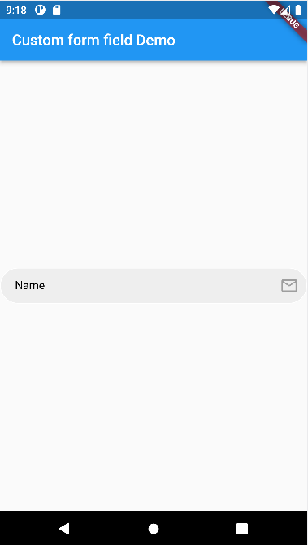
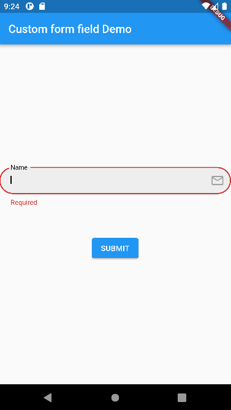

# form-field-package
A package to build elegant looking form fields without any boilerplate code. The form fields are a part of a Form object and can be customized in every little way, from field tags to label styles. This reduces the effort to make multiple form fields while making lengthy Forms.

#### Usage
```
CustomFormField().field(
              question: "Name",
              canBeNull: true,
              formKey: key,
              onSavedCallback: (String val)=>print(val),
              horizontalTextPadding: 20,
              verticalTextPadding: 10,
              labelTextStyle: TextStyle(color: Colors.black),
              icon: const Icon(
                Icons.email_outlined,
                color: Colors.grey,
                size: 25,
              ),
              fieldTextFontSize: 15,
            ),
```
</br></br></br>

#### CanBeNull parameter
You can change the `canBeNull` property to `false`, so that when `key.currentState.save()` is called, the field expresses an error.

</br></br></br>


#### onSavedCallback parameter
This is a callback function that is provded along with the form field to define function's behaviour when the form's currentState is saved. For example, we can declare a number of string params and then assign them values to them using this parameter.
```
class FormPageState extends State<FormPage> {
  GlobalKey<FormState> key = GlobalKey<FormState>();
  CustomFormField customFormField = CustomFormField();
  String? _name;
  String? _email;
  String? _age;

  @override
  Widget build(BuildContext context) {
    return Form(
        key: key,
        child: Column(
            children: [
                customFormField.field(
                    question: "Name",
                    canBeNull: false,
                    formKey: key,
                    onSavedCallback: (String val)=>_name=val,
                ),
                customFormField.field(
                    question: "Email",
                    canBeNull: false,
                    formKey: key,
                    onSavedCallback: (String val)=>_email=val,
                ),
                customFormField.field(
                    question: "Age",
                    canBeNull: false,
                    formKey: key,
                    onSavedCallback: (String val)=>_age=val,
                ),
                ]
            )
        );
    }
}
```

#### All customizable parameters

`String question`- Required parameter to specify the question to be asked.</br>
`bool canBeNull`- Required parameter to specify if entered text can be empty.</br>
`Function onSavedCallback`- Required callback parameter defining the behavious of form Field when it is saved using `key.currentState.save()`. </br>
`GlobalKey<FormState> formKey`- Required `GlobalKey<FormState>` key of the form that this form field is a part of.</br>
`double fieldTextFontSize`- Optional parameter to declare size of text inside the field.</br>
`String initialValue`- Optional parameter to declare a pre written value.</br>
`double verticalTextPadding`- Optional parameter to declare the vertical Content padding inside the field.</br>
`double horizontalTextPadding`- Optional parameter to declare the horizontal Content padding inside the field.</br>
`Icon icon`- Optional Icon to be displayed at the end of the field.</br>
`double borderRadius`- Optional parameter to declare the border radius of the field.</br>
`TextStyle labelTextStyle`- Optional parameter to declare the `TextStyle` of the label text.</br>